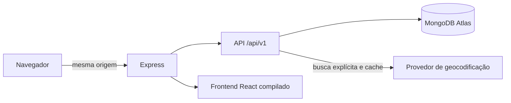

# AcessaMapa

[Demonstração online](https://acessamapa.onrender.com) · [Documentação da API](docs/openapi.yaml) · [Pipeline de CI](https://github.com/lucasppinheiro/mapa-acessibilidade/actions/workflows/ci.yml)

Criei o AcessaMapa para reunir informações de acessibilidade de locais urbanos de forma clara e verificável. Em vez de resumir tudo em uma nota, organizei cada recurso como `presente`, `ausente` ou `desconhecido` e mantive o histórico das decisões de moderação.

Tratei o mapa como uma visualização opcional. A busca, os filtros e a consulta funcionam pela lista textual, enquanto o mapa é carregado apenas quando a pessoa decide usá-lo.

A demonstração pública utiliza somente dados sintéticos e mantém novas contribuições em moderação.

## O problema que eu quis resolver

Informações sobre acessibilidade costumam aparecer dispersas, desatualizadas ou sem contexto sobre quem as verificou. Uma nota única também esconde diferenças importantes: um local pode ter rampa e, ao mesmo tempo, não ter banheiro acessível.

Minha proposta foi registrar cada recurso separadamente, mostrar quando a informação foi enviada ou confirmada e preservar o histórico das decisões de moderação.

## O que eu construí

- Busca por nome ou endereço, com normalização de acentos e retorno claro quando o local ainda não está cadastrado.
- Alternância entre lista e mapa, com o mapa carregado sob demanda para reduzir o JavaScript inicial.
- Filtros por categoria, avaliação e recursos de acessibilidade.
- Cadastro de locais com busca explícita de endereço, coordenadas editáveis e geolocalização opcional.
- Avaliações com observações por recurso, sem transformar informações diferentes em uma pontuação opaca.
- Fila de moderação para aprovar ou rejeitar locais e avaliações, com registro de auditoria.
- Perfis de usuário, moderador e administrador com permissões distintas.

## Decisões de engenharia

Escolhi um monólito modular com React, Express e MongoDB. Para o tamanho e o objetivo do projeto, essa arquitetura mantém o código fácil de executar, testar e revisar sem acrescentar a operação de microserviços.

Em produção, o Express serve o frontend compilado e a API em `/api/v1` na mesma origem. A aplicação usa MongoDB Atlas e roda como um único Web Service no Render.



Outras escolhas importantes:

- armazeno coordenadas como GeoJSON `Point` e uso um índice `2dsphere`;
- padronizo erros da API com código, mensagem e request ID;
- mantenho a geocodificação no backend, com cache, limite de requisições e provedor configurável.

## Acessibilidade na prática

Usei as WCAG 2.2 AA como referência de projeto e fiz com que as jornadas principais não dependessem do mapa. A interface está em português do Brasil porque o caso de uso foi pensado para informações locais.

- A lista permanece disponível como alternativa textual completa.
- A alternância entre lista e mapa funciona com controles nativos.
- A geolocalização só é solicitada após explicação e ação da pessoa usuária.
- Formulários associam erros aos campos, movem o foco para o primeiro erro e anunciam atualizações importantes.
- Avaliações usam botões de opção nativos agrupados em `fieldset`; recursos relacionados também usam controles nativos.
- Skip link, foco visível, títulos de página, `aria-current`, redução de movimento e `forced-colors` fazem parte da implementação.
- Testes com axe ajudam a detectar regressões nas rotas principais.

O roteiro de verificação manual está documentado em [docs/validacao-acessibilidade.md](docs/validacao-acessibilidade.md).

## Segurança, privacidade e confiança

Evitei tratar segurança e moderação como detalhes de infraestrutura. Elas fazem parte do comportamento do produto:

- respostas públicas nunca incluem e-mail, credenciais ou campos internos de governança;
- DTOs com campos permitidos evitam mass assignment;
- o cookie do refresh token usa `HttpOnly`, `Secure` e `SameSite=Lax` em produção;
- rotação, revogação da sessão atual e logout global são controlados no servidor;
- exclusão de conta anonimiza as contribuições e preserva o histórico comunitário;
- conteúdo pendente não aparece nas consultas públicas;
- somente avaliações aprovadas entram na média;
- recursos enviados pelo autor aparecem como informados, não como confirmados.

## Interface

### Consulta em tela pequena


### Cadastro com endereço e coordenadas editáveis


### Moderação com histórico


## Tecnologias

| Área | Tecnologias |
| --- | --- |
| Frontend | React 19, Vite, React Router, Leaflet e CSS responsivo |
| Backend | Node.js 24, Express 5, Mongoose e MongoDB |
| Testes | Vitest, Testing Library, axe-core, Supertest e Playwright |
| Contrato | OpenAPI 3.1 validado no CI |
| Deploy | Render e MongoDB Atlas |

## Qualidade e testes

O pipeline executa análise estática, testes unitários e de integração, cobertura, validação do contrato OpenAPI, build de produção e testes E2E. Os limites mínimos são 80% para linhas e funções e 75% para branches.

Os cenários automatizados cobrem, entre outros pontos:

- tentativa de alterar autor, status, média ou timestamps por mass assignment;
- ausência de dados sensíveis em endpoints públicos;
- rotação, reutilização indevida e revogação de sessões;
- permissões de usuário, autor e moderador;
- moderação, denúncia, arquivamento e preservação de histórico;
- navegação por teclado e recusa de geolocalização;
- equivalência de informação entre lista e mapa;
- verificações axe nas rotas principais.

## Executando localmente

Pré-requisitos:

- Node.js 24 e npm 11;
- MongoDB local em replica set ou MongoDB Atlas;
- variáveis de ambiente configuradas em `backend/.env`.

```bash
git clone https://github.com/lucasppinheiro/mapa-acessibilidade.git
cd mapa-acessibilidade
npm run setup
npm run dev
```

Para gerar e executar a versão de produção:

```bash
npm run build
npm start
```

Comandos disponíveis:

| Comando | Finalidade |
| --- | --- |
| `npm run setup` | Instala as dependências da raiz, do backend e do frontend. |
| `npm run lint` | Executa a análise estática dos dois projetos. |
| `npm test` | Executa os testes unitários e de integração. |
| `npm run coverage` | Executa os testes e verifica os limites de cobertura. |
| `npm run openapi:lint` | Valida o contrato OpenAPI 3.1. |
| `npm run build` | Gera o frontend de produção. |
| `npm run e2e` | Executa as jornadas Playwright e as verificações axe. |
| `npm run migrate` | Executa a migração idempotente dos dados legados. |
| `npm run seed` | Carrega o conjunto de dados sintéticos. |

## Deploy da demonstração

A demonstração está publicada em [acessamapa.onrender.com](https://acessamapa.onrender.com). O Render cria o serviço a partir de [render.yaml](render.yaml), executa o build do frontend e inicia o Express. O endpoint de prontidão confirma a conexão com o MongoDB antes de considerar a instância disponível.

O banco público contém apenas locais, contas e avaliações fictícias. Credenciais e a conta moderadora ficam fora do repositório.

## Documentação técnica

- [Contrato OpenAPI 3.1](docs/openapi.yaml)
- [Preparação e operação do deploy](docs/deploy.md)
- [Migração idempotente para o modelo v1](docs/migracao-v1.md)
- [Roteiro de verificação de acessibilidade](docs/validacao-acessibilidade.md)
