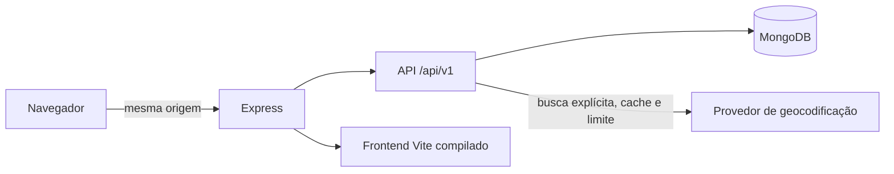
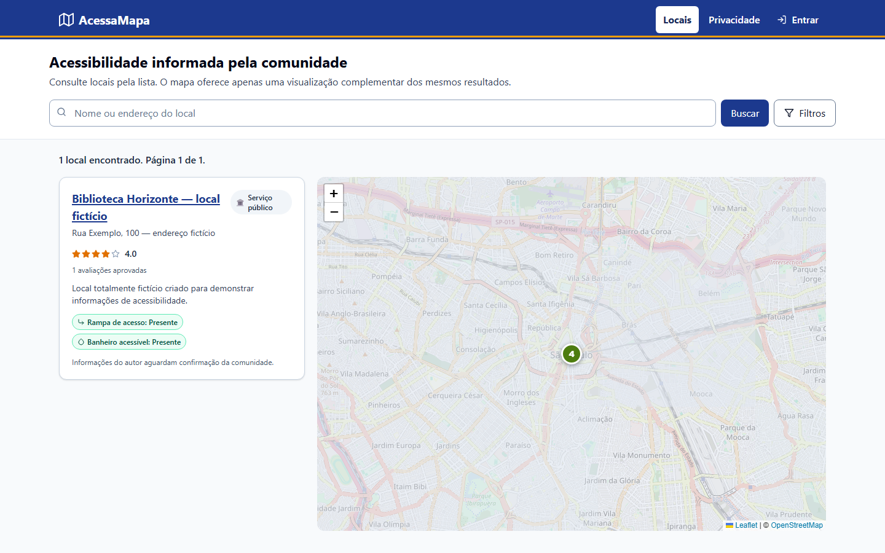
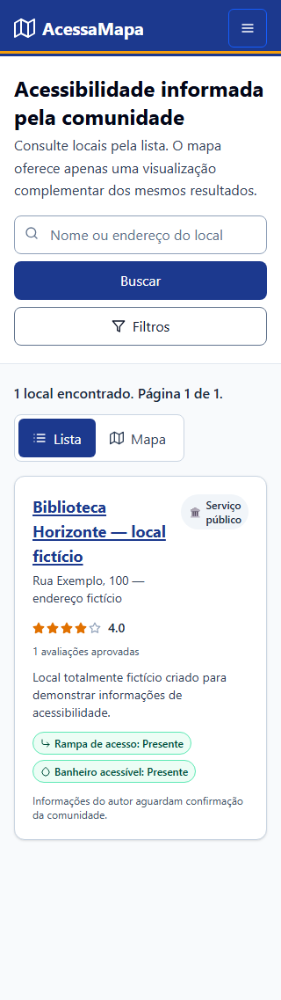
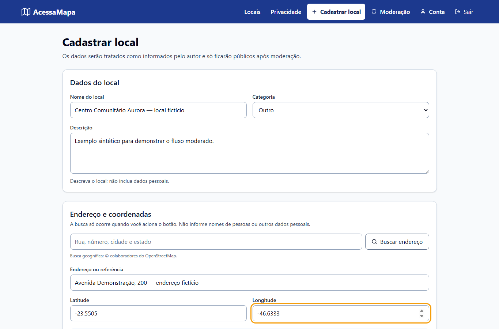
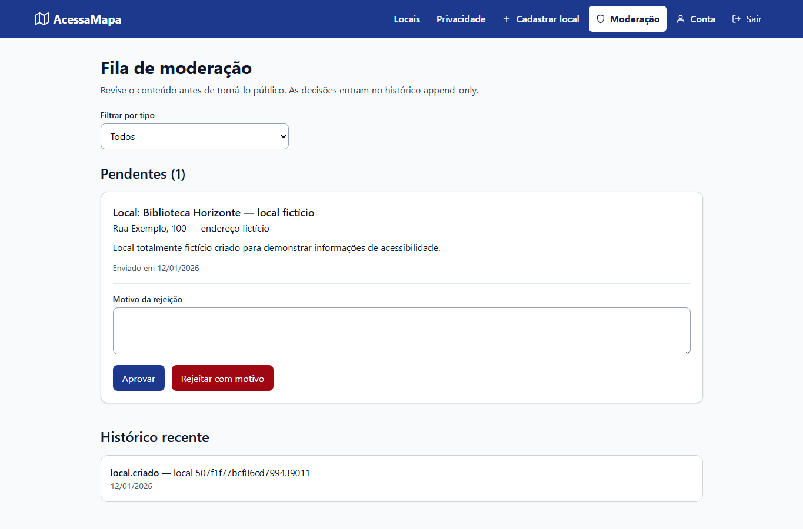

# AcessaMapa

O AcessaMapa é uma aplicação full stack para consultar e registrar informações de acessibilidade em locais urbanos. Esta versão transforma um protótipo de mapa colaborativo em um estudo de caso sobre engenharia de software, acessibilidade, privacidade e confiança comunitária.

O projeto está em evolução. A aplicação tem como **alvo** as WCAG 2.2 no nível AA, mas não declara conformidade: os testes manuais com tecnologias assistivas e os critérios documentados em [`docs/validacao-acessibilidade.md`](docs/validacao-acessibilidade.md) precisam ser concluídos e registrados antes de qualquer alegação desse tipo.

## Problema

Informações sobre acessibilidade costumam estar dispersas, ficar desatualizadas ou aparecer sem contexto sobre quem as verificou. Uma nota única também pode esconder diferenças importantes: um local pode ter rampa, mas não ter banheiro acessível, por exemplo.

O AcessaMapa trata cada informação de recurso como `presente`, `ausente` ou `desconhecido`, mostra quando ela foi informada ou verificada e submete novas contribuições à moderação. A lista textual é a experiência principal; o mapa é uma visualização complementar.

## Decisões de produto e engenharia

- **Monólito modular:** React, Express e MongoDB, sem complexidade operacional de microserviços.
- **Mesma origem:** o Express serve a API em `/api/v1` e o build do Vite em produção.
- **Privacidade por padrão:** nenhum DTO público inclui e-mail, credenciais, dados de deficiência ou campos internos de governança.
- **Dados minimizados:** o produto não pergunta o tipo de deficiência de usuários ou avaliadores.
- **Confiança explicável:** confirmações, contestações e data da última verificação são apresentadas sem uma pontuação opaca.
- **Moderação e rastreabilidade:** locais e avaliações novos entram como pendentes; decisões geram eventos append-only de auditoria.
- **Escrita controlada na demo:** `DEMO_WRITE_MODE=moderated`; o modo operacional `read_only` bloqueia novas escritas.
- **Mapa opcional:** busca, filtros, consulta, cadastro e avaliação devem funcionar por lista, teclado e leitor de tela.

## Arquitetura



O backend mantém módulos para autenticação e sessões, locais, avaliações, denúncias, moderação, geocodificação e auditoria. O contrato HTTP está documentado em [`docs/openapi.yaml`](docs/openapi.yaml).

A conversão idempotente do modelo legado e seus controles de segurança estão descritos em [`docs/migracao-v1.md`](docs/migracao-v1.md).

## Segurança e privacidade

- O access token é curto e mantido apenas em memória no navegador.
- O refresh token é opaco, armazenado como hash e enviado em cookie `HttpOnly`, `Secure` e `SameSite=Lax`.
- A renovação rotaciona o refresh token; logout da sessão atual e de todas as sessões revoga credenciais no servidor.
- DTOs com lista explícita de campos evitam mass assignment e exposição acidental.
- Papéis `usuario`, `moderador` e `admin` aplicam a matriz de permissões.
- Exclusão de conta anonimiza contribuições em vez de apagar o histórico comunitário.
- Logs estruturados usam request ID e não devem registrar tokens, senhas ou dados sensíveis.

Consulte também a página de privacidade da aplicação. Este repositório e o seed devem conter somente dados sintéticos. Não use dados reais de pessoas, evidências brutas ou credenciais.

## Acessibilidade

As jornadas são projetadas para funcionar sem depender do mapa:

- lista de locais disponível em todos os tamanhos de tela;
- alternância acessível entre lista e mapa;
- busca de endereço acionada por botão, sem autocomplete;
- resultados de endereço selecionáveis por teclado;
- latitude e longitude editáveis como alternativa;
- geolocalização solicitada somente após explicação e ação do usuário;
- estrelas editáveis como grupo de opções de rádio;
- recursos agrupados em `fieldset` com controles nativos;
- erros associados aos campos, foco no primeiro erro e regiões vivas;
- foco visível, contraste de estados e suporte a `forced-colors` e redução de movimento.

Testes automatizados ajudam a detectar regressões, mas não substituem validação manual com teclado, leitor de tela, zoom e alto contraste.

## Confiança comunitária

- Recursos cadastrados pelo autor são identificados como **informados**, não confirmados.
- Apenas avaliações aprovadas entram na média; sem avaliações, a interface mostra “Ainda não avaliado”.
- Conteúdo pendente não aparece na consulta pública.
- Edições materiais em um local aprovado retornam à fila de moderação.
- Aprovação, rejeição, denúncia e arquivamento preservam histórico.
- Autores não podem apagar definitivamente contribuições de terceiros.

## Stack

- Frontend: React 19, Vite, React Router, Leaflet e CSS responsivo.
- Backend: Node.js 24, Express, Mongoose e MongoDB.
- Qualidade: Vitest, Testing Library, axe-core, Supertest e Playwright.
- Contrato: OpenAPI 3.1 validado no CI.
- Hospedagem planejada: um Web Service no Render e MongoDB Atlas.

## Executando localmente

Pré-requisitos:

- Node.js 24 e npm 11;
- MongoDB local em replica set ou MongoDB Atlas, sempre em banco isolado para desenvolvimento;
- nenhuma credencial ou dado real no repositório.

```bash
git clone https://github.com/lucasppinheiro/mapa-acessibilidade.git
cd mapa-acessibilidade
npm run setup
```

Copie o exemplo de ambiente do backend para `backend/.env` e use valores locais. Nunca versione o arquivo `.env`.

```bash
npm run dev
```

O Vite inicia o frontend em desenvolvimento e o Express inicia a API. Em produção, execute o build e inicie somente o Express:

```bash
npm run build
npm start
```

## Comandos

| Comando | Finalidade |
| --- | --- |
| `npm run setup` | Instala dependências da raiz, backend e frontend com lockfiles. |
| `npm run lint` | Executa análise estática nos dois projetos. |
| `npm test` | Executa testes unitários e de integração. |
| `npm run coverage` | Verifica os limites mínimos de cobertura. |
| `npm run openapi:lint` | Valida o contrato OpenAPI 3.1. |
| `npm run build` | Gera o frontend de produção. |
| `npm run e2e` | Executa jornadas Playwright e verificações axe. |
| `npm run migrate` | Executa a migração idempotente de dados legados. |
| `npm run seed` | Carrega somente o dataset sintético idempotente. |

## Testes e critérios

O pipeline executa lint, testes, cobertura, validação OpenAPI, build e E2E. Os limites adotados são 80% para linhas e funções e 75% para branches.

Entre os cenários de segurança e confiança estão mass assignment, ausência de dados sensíveis em respostas públicas, rotação e revogação de sessões, permissões, visibilidade de conteúdo pendente e preservação do histórico de moderação.

Entre os cenários de acessibilidade estão navegação somente por teclado, recusa de geolocalização, equivalência entre lista e mapa e ausência de violações axe críticas ou sérias nas rotas principais. A validação manual continua obrigatória.

## Deploy da demonstração

O arquivo [`render.yaml`](render.yaml) prepara um único Web Service. O provisionamento ainda está **pendente** e depende de autorização e credenciais fornecidas fora do repositório.

Antes de publicar:

1. criar um usuário exclusivo da aplicação no MongoDB Atlas;
2. restringir a lista de rede do Atlas ao ambiente necessário;
3. configurar segredos no painel do Render, nunca no Git;
4. executar migração e seed sintético no ambiente autorizado;
5. manter a conta moderadora privada e fora do repositório;
6. concluir o roteiro manual de acessibilidade;
7. executar smoke test usando somente dados sintéticos.

O uso de replica set é obrigatório porque as decisões de moderação e operações de arquivamento preservam consistência por transação.

Não há URL pública confirmada nesta versão. O link de demonstração será adicionado apenas após deploy e validação. As capturas abaixo foram geradas localmente com fixtures exclusivamente sintéticas.

## Evidências visuais

### Lista textual e mapa complementar no desktop



### Lista como visualização inicial em 320 px



### Cadastro com endereço e coordenadas manuais



### Fila de moderação e histórico



As imagens documentam a apresentação visual, mas não substituem a descrição textual nem a validação com tecnologias assistivas.

## Limitações conhecidas

- Não houve pesquisa formal com pessoas com deficiência nesta v1.
- A conformidade WCAG 2.2 AA ainda não foi validada manualmente.
- A qualidade das contribuições depende da operação de moderação.
- A geocodificação depende de provedor externo configurável; a interface não oferece autocomplete.
- O mapa não substitui uma descrição textual equivalente.
- Deploy, domínio, Atlas e credenciais permanecem pendentes de provisionamento.

## Estado da autoria e licença

A origem e os termos de licenciamento anteriores ainda precisam ser validados. Por esse motivo, este repositório não declara uma licença de uso e não inclui arquivo `LICENSE` nesta versão.
